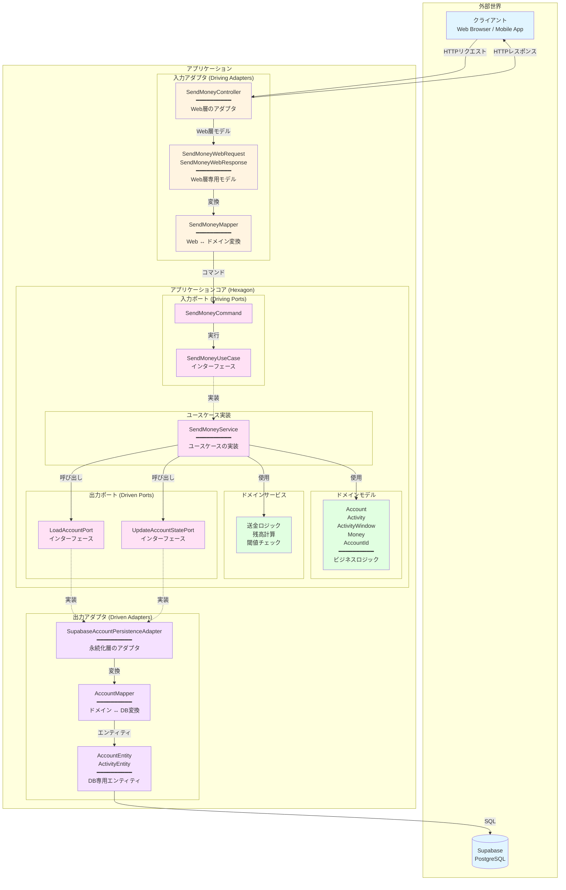
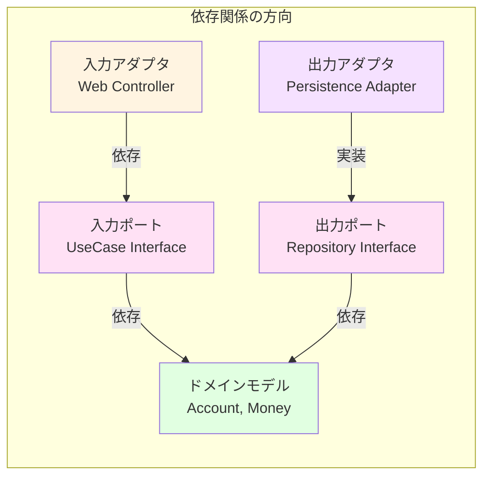
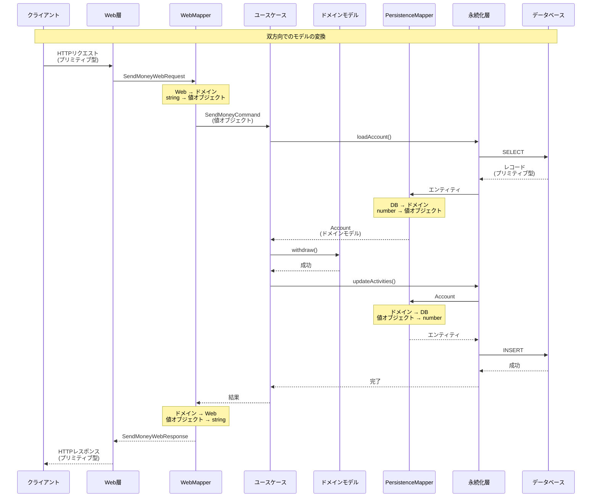

# レイヤーアーキテクチャの全体図

## 📖 概要

このドキュメントでは、Buckpalプロジェクトのヘキサゴナルアーキテクチャ（ポート&アダプターアーキテクチャ）の全体構造を、Mermaid図を使って視覚的に説明します。

---

## 🏗️ ヘキサゴナルアーキテクチャ全体図



### 🎨 色分けの意味

- 🔵 **水色** (`#e1f5ff`): 外部世界（クライアント、データベース）
- 🟡 **黄色** (`#fff4e1`): 入力アダプタ（Web層）
- 🟣 **ピンク** (`#ffe1f5`): アプリケーションコア（ポート、ユースケース）
- 🟢 **緑色** (`#e1ffe1`): ドメインモデル（ビジネスロジック）
- 🟪 **紫色** (`#f5e1ff`): 出力アダプタ（永続化層）

---

## 📁 ディレクトリ構造とアーキテクチャの対応

```
src/
├── adapter/                    # アダプタ層
│   ├── in/                     # 入力アダプタ (Driving Adapters)
│   │   └── web/
│   │       ├── models/         # Web層専用モデル
│   │       │   ├── SendMoneyWebRequest.ts
│   │       │   └── SendMoneyWebResponse.ts
│   │       ├── mappers/        # Web ↔ ドメイン変換
│   │       │   └── SendMoneyMapper.ts
│   │       └── SendMoneyController.ts
│   │
│   └── out/                    # 出力アダプタ (Driven Adapters)
│       └── persistence/
│           ├── entities/       # DB専用エンティティ
│           │   ├── AccountEntity.ts
│           │   └── ActivityEntity.ts
│           ├── mappers/        # ドメイン ↔ DB変換
│           │   └── AccountMapper.ts
│           ├── SupabaseAccountPersistenceAdapter.ts
│           └── InMemoryAccountPersistenceAdapter.ts
│
└── application/                # アプリケーションコア
    ├── domain/                 # ドメイン層
    │   ├── model/              # ドメインモデル
    │   │   ├── Account.ts
    │   │   ├── Activity.ts
    │   │   ├── ActivityWindow.ts
    │   │   └── Money.ts
    │   └── service/            # ドメインサービス
    │       ├── MoneyTransferService.ts
    │       └── ThresholdExceededException.ts
    │
    ├── port/                   # ポート（インターフェース）
    │   ├── in/                 # 入力ポート (Driving Ports)
    │   │   ├── SendMoneyUseCase.ts
    │   │   └── SendMoneyCommand.ts
    │   └── out/                # 出力ポート (Driven Ports)
    │       ├── LoadAccountPort.ts
    │       ├── UpdateAccountStatePort.ts
    │       └── AccountLock.ts
    │
    └── service/                # ユースケース実装
        └── SendMoneyService.ts
```

---

## 🔄 依存関係の方向

ヘキサゴナルアーキテクチャでは、依存関係の方向が重要です。



### 依存関係のルール

1. **アダプタ → ポート**: アダプタはポートに依存する
2. **ポート → ドメイン**: ポートはドメインモデルに依存する
3. **ドメイン → なし**: ドメインモデルは他のどの層にも依存しない

このルールにより、**ドメインモデルが中心**となり、アダプタやポートが外側に配置されます。

---

## 🌐 Web層の詳細構造

```mermaid
graph TB
    subgraph "Web層 (入力アダプタ)"
        HTTP[HTTPリクエスト<br/>POST /accounts/send<br/>{sourceAccountId: "1", ...}]
        
        Controller[SendMoneyController]
        
        Validator[Zod Validator<br/>SendMoneyWebRequestSchema]
        
        WebRequest[SendMoneyWebRequest<br/>━━━━━━━━━━<br/>string sourceAccountId<br/>string targetAccountId<br/>string amount]
        
        Mapper[SendMoneyMapper<br/>━━━━━━━━━━<br/>toCommand()<br/>toSuccessResponse()<br/>toErrorResponse()]
        
        Command[SendMoneyCommand<br/>━━━━━━━━━━<br/>AccountId sourceAccountId<br/>AccountId targetAccountId<br/>Money money]
        
        WebResponse[SendMoneyWebResponse<br/>━━━━━━━━━━<br/>boolean success<br/>string message<br/>object data]
        
        HTTPResponse[HTTPレスポンス<br/>200 OK<br/>{success: true, ...}]
    end
    
    subgraph "アプリケーション層"
        UseCase[SendMoneyUseCase]
    end
    
    HTTP -->|パース| Controller
    Controller -->|バリデーション| Validator
    Validator -->|OK| WebRequest
    WebRequest -->|変換| Mapper
    Mapper -->|生成| Command
    Command -->|実行| UseCase
    UseCase -->|結果| Mapper
    Mapper -->|生成| WebResponse
    WebResponse -->|シリアライズ| HTTPResponse
    
    style HTTP fill:#e1f5ff
    style Controller fill:#fff4e1
    style Validator fill:#fff4e1
    style WebRequest fill:#fff4e1
    style Mapper fill:#fff4e1
    style Command fill:#ffe1f5
    style WebResponse fill:#fff4e1
    style HTTPResponse fill:#e1f5ff
    style UseCase fill:#ffe1f5
```

---

## 💾 永続化層の詳細構造

```mermaid
graph TB
    subgraph "アプリケーション層"
        UseCase[SendMoneyUseCase]
        Port1[LoadAccountPort]
        Port2[UpdateAccountStatePort]
        Domain[Account<br/>ドメインモデル]
    end
    
    subgraph "永続化層 (出力アダプタ)"
        Adapter[SupabaseAccountPersistenceAdapter<br/>━━━━━━━━━━<br/>loadAccount()<br/>updateActivities()]
        
        Mapper[AccountMapper<br/>━━━━━━━━━━<br/>toDomain()<br/>toActivityEntities()<br/>calculateBaselineBalance()]
        
        Aggregate[AccountAggregateEntity<br/>━━━━━━━━━━<br/>AccountEntity account<br/>ActivityEntity[] activities<br/>number baselineBalance]
        
        Entity1[AccountEntity<br/>━━━━━━━━━━<br/>number id]
        
        Entity2[ActivityEntity<br/>━━━━━━━━━━<br/>number id<br/>string timestamp<br/>number owner_account_id<br/>number amount]
        
        DB[(Supabase DB<br/>━━━━━━━━━━<br/>accounts テーブル<br/>activities テーブル)]
    end
    
    UseCase -->|呼び出し| Port1
    UseCase -->|呼び出し| Port2
    Port1 -.実装.-> Adapter
    Port2 -.実装.-> Adapter
    
    Adapter -->|SELECT| DB
    DB -->|レコード| Entity1
    DB -->|レコード| Entity2
    Entity1 -->|集約| Aggregate
    Entity2 -->|集約| Aggregate
    Aggregate -->|変換| Mapper
    Mapper -->|生成| Domain
    Domain -->|返却| UseCase
    
    UseCase -->|保存要求| Port2
    Port2 -->|呼び出し| Adapter
    Domain -->|変換| Mapper
    Mapper -->|生成| Entity2
    Entity2 -->|INSERT| DB
    
    style UseCase fill:#ffe1f5
    style Port1 fill:#ffe1f5
    style Port2 fill:#ffe1f5
    style Domain fill:#e1ffe1
    style Adapter fill:#f5e1ff
    style Mapper fill:#f5e1ff
    style Aggregate fill:#f5e1ff
    style Entity1 fill:#f5e1ff
    style Entity2 fill:#f5e1ff
    style DB fill:#e1f5ff
```

---

## 🎯 アプリケーションコアの詳細構造

```mermaid
graph TB
    subgraph "入力ポート (Driving Ports)"
        UseCaseInterface[SendMoneyUseCase<br/>インターフェース<br/>━━━━━━━━━━<br/>sendMoney(command): Promise boolean]
        Command[SendMoneyCommand<br/>━━━━━━━━━━<br/>AccountId sourceAccountId<br/>AccountId targetAccountId<br/>Money money]
    end
    
    subgraph "ユースケース実装"
        UseCaseImpl[SendMoneyService<br/>━━━━━━━━━━<br/>sendMoney()の実装]
    end
    
    subgraph "ドメインモデル"
        Account[Account<br/>━━━━━━━━━━<br/>withdraw(money, targetAccountId)<br/>deposit(money, sourceAccountId)<br/>calculateBalance()]
        
        Activity[Activity<br/>━━━━━━━━━━<br/>取引の記録]
        
        ActivityWindow[ActivityWindow<br/>━━━━━━━━━━<br/>取引のコレクション]
        
        Money[Money<br/>━━━━━━━━━━<br/>金額の値オブジェクト<br/>plus(), minus(), isPositive()]
        
        AccountId[AccountId<br/>━━━━━━━━━━<br/>アカウントIDの値オブジェクト]
    end
    
    subgraph "ドメインサービス"
        ThresholdCheck[送金額の閾値チェック<br/>━━━━━━━━━━<br/>ThresholdExceededException]
        
        MoneyTransfer[送金ロジック<br/>━━━━━━━━━━<br/>出金 + 入金の調整]
    end
    
    subgraph "出力ポート (Driven Ports)"
        LoadPort[LoadAccountPort<br/>インターフェース<br/>━━━━━━━━━━<br/>loadAccount(accountId, baselineDate)]
        
        UpdatePort[UpdateAccountStatePort<br/>インターフェース<br/>━━━━━━━━━━<br/>updateActivities(account)]
        
        LockPort[AccountLock<br/>インターフェース<br/>━━━━━━━━━━<br/>lockAccount(accountId)<br/>releaseAccount(accountId)]
    end
    
    Command -->|使用| UseCaseInterface
    UseCaseInterface -.実装.-> UseCaseImpl
    UseCaseImpl -->|呼び出し| LoadPort
    UseCaseImpl -->|呼び出し| UpdatePort
    UseCaseImpl -->|呼び出し| LockPort
    UseCaseImpl -->|使用| Account
    UseCaseImpl -->|使用| ThresholdCheck
    UseCaseImpl -->|使用| MoneyTransfer
    
    Account -->|持つ| ActivityWindow
    ActivityWindow -->|持つ| Activity
    Account -->|使用| Money
    Account -->|使用| AccountId
    Activity -->|使用| Money
    Activity -->|使用| AccountId
    
    style UseCaseInterface fill:#ffe1f5
    style Command fill:#ffe1f5
    style UseCaseImpl fill:#ffe1f5
    style Account fill:#e1ffe1
    style Activity fill:#e1ffe1
    style ActivityWindow fill:#e1ffe1
    style Money fill:#e1ffe1
    style AccountId fill:#e1ffe1
    style ThresholdCheck fill:#e1ffe1
    style MoneyTransfer fill:#e1ffe1
    style LoadPort fill:#ffe1f5
    style UpdatePort fill:#ffe1f5
    style LockPort fill:#ffe1f5
```

---

## 🔄 データの流れ（完全版）



---

## 🔗 関連ドキュメント

- [01-mapping-strategy.md](../architecture/01-mapping-strategy.md) - 双方向モデル変換の概要
- [02-layer-models.md](../architecture/02-layer-models.md) - 各層のモデルの詳細
- [03-mappers-guide.md](../architecture/03-mappers-guide.md) - マッパーの実装ガイド
- [04-strategy-comparison.md](../architecture/04-strategy-comparison.md) - 3つの戦略の比較
- [mapping-flow.md](./mapping-flow.md) - 変換フローの詳細
