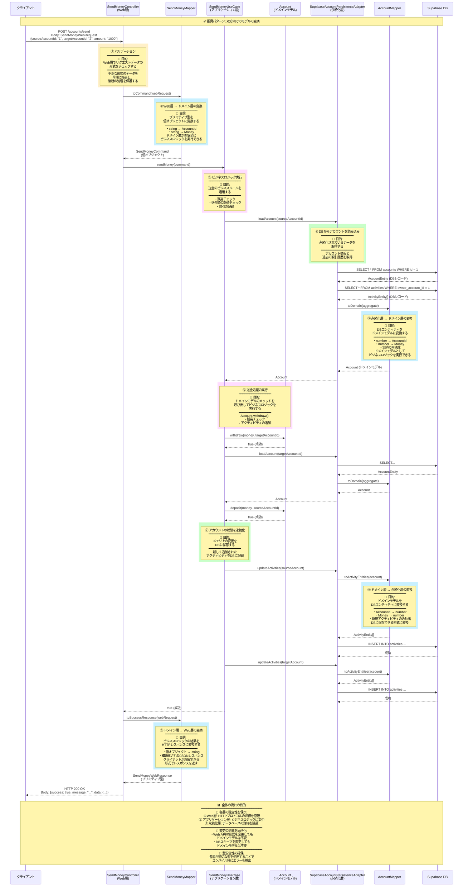
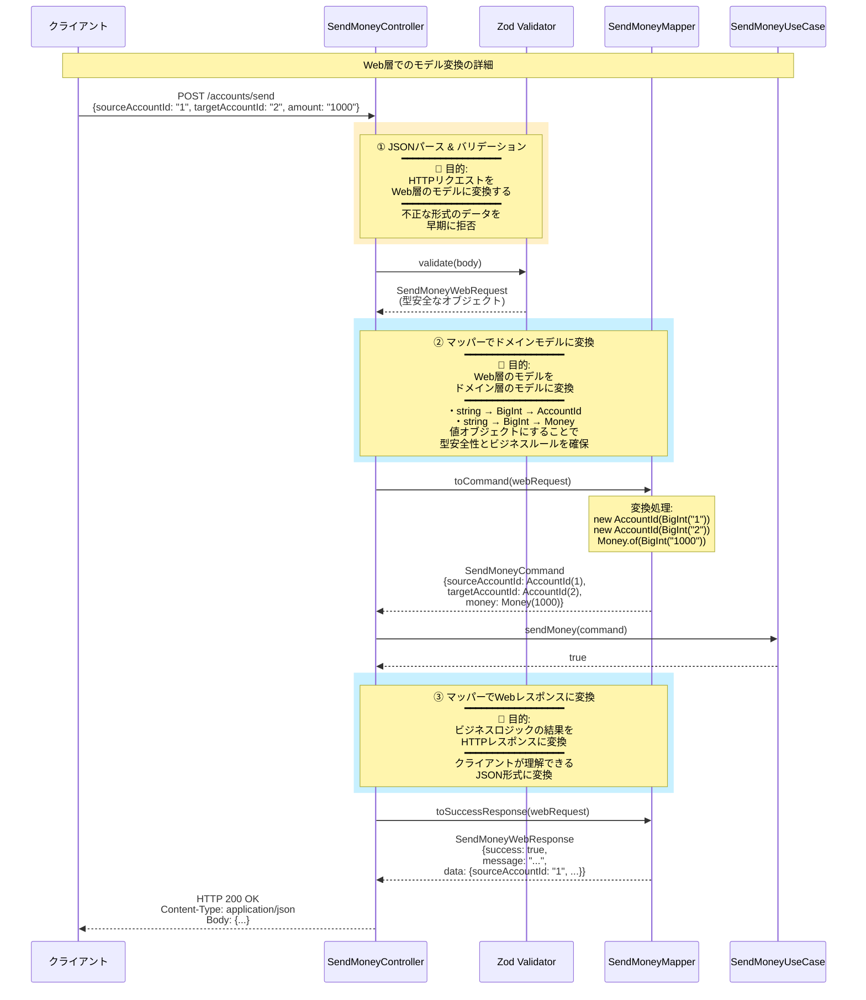
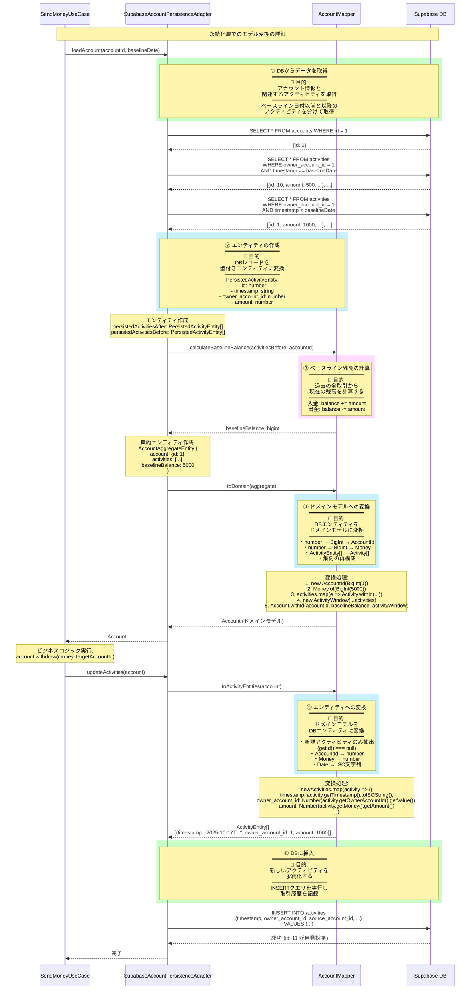

# 双方向モデル変換のフロー図

## 📖 概要

このドキュメントでは、Mermaidシーケンス図を使って、双方向でのモデルの変換の流れを視覚的に説明します。

---

## 🔄 送金処理の全体フロー

以下の図は、HTTPリクエストからレスポンスまでの送金処理の全体的な流れを示しています。

---

## 🔄 Web層でのモデル変換（詳細）

Web層でのリクエスト/レスポンスの変換を詳細に示します。

---

## 🔄 永続化層でのモデル変換（詳細）

永続化層でのDBとドメインモデルの変換を詳細に示します。

---

## 🔗 関連ドキュメント

- [01-mapping-strategy.md](../architecture/01-mapping-strategy.md) - 双方向モデル変換の概要
- [02-layer-models.md](../architecture/02-layer-models.md) - 各層のモデルの詳細
- [03-mappers-guide.md](../architecture/03-mappers-guide.md) - マッパーの実装ガイド
- [layer-architecture.md](./layer-architecture.md) - レイヤーアーキテクチャの全体図
